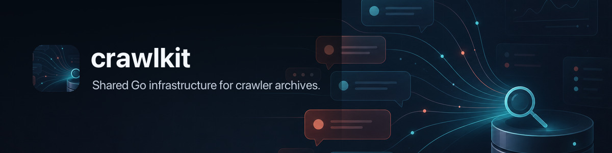

# ✈️ telecrawl



Telegram archive CLI.

`telecrawl` reads local Telegram Desktop `tdata` archives and native Telegram
for macOS Postbox databases, stores a searchable SQLite archive in
`~/.telecrawl/telecrawl.db`, and can back it up to GitHub as encrypted age
shards.

It is local-first:

- Normal archive/search commands do not upload data.
- `backup push` uploads only age-encrypted shards when you run it explicitly.
- Telegram message text, chat names, sender names, contact phone numbers,
  contact usernames, avatar path metadata, and media metadata stay inside
  encrypted backup payloads.

## Install

```bash
brew tap steipete/tap
brew install telecrawl
```

Or install with Go:

```bash
go install github.com/openclaw/telecrawl/cmd/telecrawl@latest
```

### Docker

```bash
docker build -t telecrawl .
docker run --rm -v "$HOME/.telecrawl:/data" -v "$HOME/Library/Application Support/Telegram Desktop/tdata:/tdata:ro" telecrawl --source /tdata doctor
docker run --rm -v "$HOME/.telecrawl:/data" -v "$HOME/Library/Application Support/Telegram Desktop/tdata:/tdata:ro" telecrawl --source /tdata import
```

Mount Telegram Desktop `tdata` read-only and keep the archive/config under `/data`.

## Setup

No language runtime setup is required. `telecrawl` imports Telegram Desktop
`tdata` and native macOS Postbox data through the Go binary.

## Import

```bash
telecrawl doctor
telecrawl import
telecrawl status
```

Import defaults to:

- latest `200` dialogs
- latest `500` messages per dialog

Use `0` for no limit:

```bash
telecrawl import --dialogs-limit 0 --messages-limit 0
```

Add `--fetch-media` when you also want Telegram cloud media that is not cached
locally:

```bash
telecrawl import --dialogs-limit 0 --messages-limit 0 --fetch-media
```

Remote media fetches are bounded best-effort operations. Import stats report how
many remote media candidates were attempted, downloaded, still missing,
unavailable, timed out, or errored.

Repeat imports reuse existing archived media for the same source before remote
fetch is attempted, so `--fetch-media` only tries media that is not already in
the local archive.

Native Postbox can tag link previews, polls, geo/live-geo, service messages, or
deleted messages as broad media candidates. `telecrawl` archives their decoded
message metadata separately from binary media, and only keeps them as media rows
when Telegram returns a downloadable file.
`metadata_json` is a local source-native Postbox payload for later rendering or
search; it is not a cross-source schema and can contain private Telegram
metadata.

When no `--source` is provided on macOS, `telecrawl` checks Telegram Desktop
`tdata` first, then the native Telegram for macOS group container. No backend
flag is needed. To import a copied archive directly:

```bash
telecrawl import --path "$HOME/Library/Group Containers/6N38VWS5BX.ru.keepcoder.Telegram"
```

Native macOS imports include every local `account-*` database they find; if more
than one account is present, stored chat and sender IDs are account-scoped to
avoid collisions. They archive cached media by default and store Telegram peer
records as contacts for message enrichment. Contacts can include phone numbers,
usernames, and archived avatar paths when those values exist locally, and are
visible through `telecrawl contacts`. `--fetch-media` also uses the existing
native Telegram session to fetch missing cloud media when account auth data is
present; this does not launch Telegram or start a login/2FA flow.

Useful reads:

```bash
telecrawl folders
telecrawl contacts
telecrawl chats --limit 20
telecrawl chats --folder FOLDER_ID
telecrawl chats --unread
telecrawl topics --chat CHAT_ID
telecrawl messages --limit 20
telecrawl messages --chat CHAT_ID --after 2026-01-01
telecrawl messages --chat CHAT_ID --topic TOPIC_ID
telecrawl messages --chat CHAT_ID --pinned
telecrawl search "query"
telecrawl search "query" --chat CHAT_ID --topic TOPIC_ID
```

Telegram folders, forum topics, reply/thread IDs, pinned messages, edits,
forwards, reactions, view/reply counts, and richer media titles are archived
when the local source or Telegram API exposes them for the active account.
Folder rows include explicit membership from Telegram dialog filters; dynamic
folder rules are recorded as metadata and may not expand to every matching
chat.

Add `--json` before the command for machine-readable output:

```bash
telecrawl --json status
telecrawl --json search "invoice"
```

## Data Paths

Defaults:

- Telegram Desktop source: `~/Library/Application Support/Telegram Desktop/tdata`
- native macOS Postbox source:
  `~/Library/Group Containers/6N38VWS5BX.ru.keepcoder.Telegram`
- archive DB: `~/.telecrawl/telecrawl.db`
- archived media copied from local Telegram caches, plus Telegram cloud media
  when `--fetch-media` is used: `~/.telecrawl/media/`
- backup config: `~/.telecrawl/backup.json`
- age identity: `~/.telecrawl/age.key`
- backup checkout: `~/Projects/backup-telecrawl`

Override the archive DB:

```bash
telecrawl --db /tmp/telecrawl.db status
```

Override the Telegram source:

```bash
telecrawl --source "/path/to/tdata" doctor
telecrawl --source "/path/to/tdata" import
telecrawl --source "/path/to/6N38VWS5BX.ru.keepcoder.Telegram" import
```

## Backup

Create `https://github.com/steipete/backup-telecrawl` first, then initialize:

```bash
telecrawl backup init
telecrawl backup push
```

The default backup config points at:

```json
{
  "repo": "~/Projects/backup-telecrawl",
  "remote": "https://github.com/steipete/backup-telecrawl.git",
  "identity": "~/.telecrawl/age.key"
}
```

Use a different repository or config path:

```bash
telecrawl backup init \
  --config ~/.telecrawl/backup.json \
  --repo ~/Projects/backup-telecrawl \
  --remote https://github.com/steipete/backup-telecrawl.git
```

Inspect backup metadata:

```bash
telecrawl backup status
```

Restore into the current archive DB:

```bash
telecrawl backup pull
telecrawl status
```

Restore into a throwaway DB for validation:

```bash
telecrawl --db /tmp/telecrawl-restore-test.db backup pull
telecrawl --db /tmp/telecrawl-restore-test.db status
```

## Backup Security Model

Backup shards are JSONL, gzip-compressed with deterministic gzip metadata, and
encrypted with age before Git sees them.

Git can still see cleartext metadata:

- export time
- public age recipients
- table names
- row counts
- shard paths
- encrypted byte sizes
- plaintext shard hashes
- backup cadence and which encrypted shards changed

Git cannot read message text, chat names, sender names, contact phone numbers,
contact usernames, avatar path metadata, or media metadata without an age
identity. Binary media files and cached avatar files archived in
`~/.telecrawl/media/` are local only and are not included in backup shards.

Keep `~/.telecrawl/age.key` private. If you lose it and no other recipient can
decrypt the backup, the encrypted backup cannot be restored.

## Multi-Machine Backups

On another machine:

```bash
telecrawl backup init --no-push
cat ~/.telecrawl/backup.json
```

Copy that machine's public `recipient` into the first machine's
`~/.telecrawl/backup.json`, then re-encrypt current shards:

```bash
telecrawl backup push
```

The private `AGE-SECRET-KEY-...` identity must not be committed or shared.

## Reset

Remove local state:

```bash
rm -rf ~/.telecrawl
```

Remove only the archive:

```bash
rm -f ~/.telecrawl/telecrawl.db ~/.telecrawl/telecrawl.db-*
```

Do not delete `~/.telecrawl/age.key` unless you have another working backup
recipient or you no longer need to restore existing encrypted backups.
