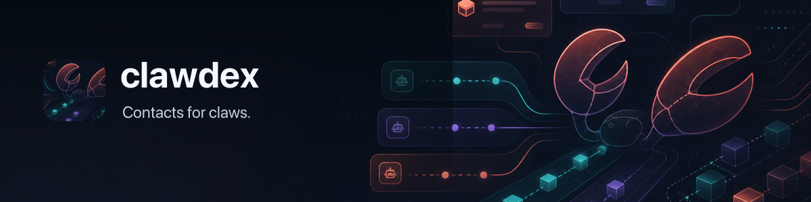

# 🧩 clawdex



Local-first contact crawler and markdown archive CLI.

`clawdex` is a local-first contact crawler and markdown archive CLI. The app lives in this
repo; your contacts live in a separate private Git-backed markdown repo.

Contacts stay local by default. To back up or sync across machines, configure a
private Git remote you own:

```bash
https://github.com/<you>/backup-clawdex.git
```

## Setup

Install from Homebrew after the first tagged release:

```bash
brew install steipete/tap/clawdex
```

Or build locally:

```bash
go install github.com/openclaw/clawdex/cmd/clawdex@latest
```

```bash
clawdex init ~/.clawdex/contacts
clawdex config set repo_path ~/.clawdex/contacts
clawdex config set git.remote https://github.com/<you>/backup-clawdex.git
```

Or set the backup remote during initialization:

```bash
clawdex init ~/.clawdex/contacts --remote https://github.com/<you>/backup-clawdex.git
```

`init` creates a data repo:

```text
clawdex.toml
people/
index/
.clawdex/repairs/
```

Config is stored at `~/.clawdex/config.toml` by default. `--repo DIR` or
`CLAWDEX_REPO=DIR` overrides the configured contacts repo for one run.

## Examples

```bash
clawdex person add "Sally O'Malley" --email sally@example.com --tag friend
clawdex note add sally --kind dm --source whatsapp --text "Follow up about dinner"
clawdex person list
clawdex person show sally
clawdex person avatar set sally ~/Pictures/sally.jpg
clawdex person avatar show sally --path
clawdex timeline sally
clawdex search dinner
clawdex export vcard --all --include-avatars -o contacts.vcf
clawdex git status
clawdex git commit -m "sync: update contacts"
clawdex git push
```

## Imports And Sync Safety

Apple and Google imports write only to the local markdown data repo.

```bash
clawdex import apple --dry-run
clawdex import apple --avatars
clawdex import google --account steipete@gmail.com --dry-run
clawdex import google --account steipete@gmail.com --avatars --dry-run
clawdex import birdclaw --min-messages 4 --dry-run
clawdex import discrawl --min-messages 4 --dry-run
```

Apple direct import uses macOS `Contacts.framework`. Linux builds still support
markdown, notes, search, Git, Google via `gog`, and vCard export.

Avatar imports are opt-in with `--avatars`. Apple reads thumbnails from
Contacts.framework. Google uses `gog contacts raw --person-fields photos`,
fetches the selected photo URL bytes, then stores thumbnails as local files
under each person directory and records only metadata in `person.md`. Manual
avatars are not overwritten by Apple/Google imports.

Birdclaw and Discrawl DM imports read local archives only. They import DM
conversations with more than `--min-messages` messages, add source-specific
tags, and store stable pointers under `accounts.x` or `accounts.discord`.

`sync apple` and `sync google` are preview-only placeholders for now. Remote
address-book writes need a conflict report before they become active. Notes stay
local-only and are never written to Apple or Google.

## Markdown Repair

People and note files use YAML frontmatter plus a Markdown body. `clawdex`
parses strictly first, then does best-effort repair when frontmatter is damaged:

- salvage known scalar keys such as `id`, `name`, `created_at`, and note fields
- infer missing IDs and timestamps
- preserve the Markdown body
- copy the original file under `.clawdex/repairs/`
- append damaged metadata to the body under `Recovered metadata`
- warn about missing or stale avatar files and repair avatar metadata when the
  image still exists

Preview repairs:

```bash
clawdex doctor --repair --dry-run
```

Apply repairs:

```bash
clawdex doctor --repair
```

## Storage

```text
people/
  sally-o-malley/
    person.md
    avatars/
      avatar.jpg
    notes/
      2026-05-08T09-15-00Z-whatsapp.md
    attachments/
index/
  emails.json
  phones.json
  handles.json
```

The `index/*.json` files are derived and rebuildable. Markdown is canonical.

## Releases

Tagged releases are built by GoReleaser for macOS, Linux, and Windows. The
release workflow also dispatches `steipete/homebrew-tap` to update
`Formula/clawdex.rb` after the GitHub release assets are published.

Release checklist: [`docs/RELEASING.md`](docs/RELEASING.md).
