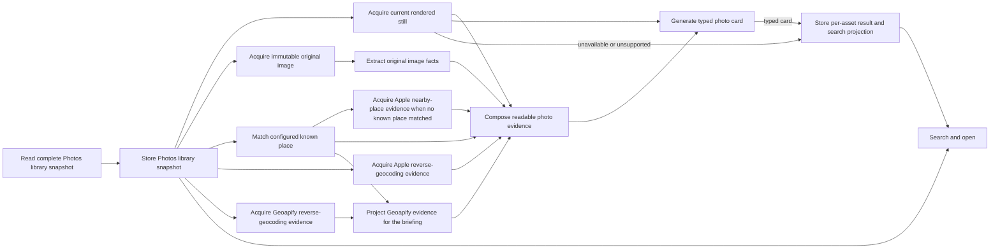

# Photos v1 accepted design

This document is the accepted post-Milestone-0 design. It is not a description
of current runtime behaviour. The current implementation still has separate
classification and Ollama paths; the implementation outcomes remove them as
the one `trawl update photos` product lands.

The Photos trawler gives OpenTrawl read-only access to Apple Photos. One update
indexes the library, acquires useful source facts and current images, enriches
capture location, generates searchable photo cards and stores the results.

The normal user invokes this work through `trawl update photos`. Import,
enrichment, classification and backfill are not separate product journeys.

## Dependency graph

Photos update is a small explicit dependency graph. Each substantial component
performs one job and can be run independently against real input. The update
composer is the only concurrency owner; components do not create worker pools
or a generic workflow engine.



Different assets may occupy different nodes at once. Dependencies remain
explicit within one asset. Missing GPS is a successful terminal condition for
location acquisition and does not prevent a card. Unavailable or unsupported
current media is an honest typed outcome and prevents only visual card
generation.

## Source and image roles

The trawler reads one complete Photos.sqlite library snapshot and stores
source-native assets, resources, album membership, capture facts and source
state. PhotoKit is used only for permission/readiness and exact current or
original media acquisition. It is not a competing library-enumeration path.
The trawler never changes Photos, albums, metadata, faces, media or iCloud.

Only a proved-complete snapshot may establish that an asset is missing. An
unavailable resource, failed extraction or incomplete source read is not a
source deletion.

Apple exposes two useful image roles:

- the immutable camera original supplies provenance and lossless ImageIO facts;
- the current rendered still, including user edits and orientation, supplies
  the image shown to the card model.

The original and current image may be byte-identical, but the implementation
does not assume this. Image acquisition publishes an entry only after its
identity, size and digest are proved.

## Bounded media ownership

Media copies are regenerable working data, not a second Photos library. The
normal product uses one bounded resumable working cache. Initial implementation
limits are 512 MiB and a 2 GiB filesystem free-space floor; the source/media
outcome locks final values from measured peak active bytes and the largest real
entry. A proved entry is leased while a component reads it and removed after
its final durable consumer commits.
Abandoned partial files are removed during the next normal update.

Development may point the same cache implementation at an explicitly
configured external volume, capacity and free-space floor. It may retain
completed entries to make repeated real-library inspection fast. It does not
use another resolver, checkpoint database, source selection rule or product
workflow.

## Location evidence

Known capture places and configured geographic providers supply factual
context. Each provider operation retains its exact response and typed outcome
separately. One provider never overwrites another.

Known-place matching runs before nearby-place exposure. A known home or work
match preserves Apple and Geoapify hierarchy, skips Apple nearby acquisition
and excludes Geoapify nearby candidates from the model briefing. It does not
automatically become the photographed place.

Nearby requests accept at most 100 provider-ordered results. Code removes only
an exact repeated provider/place identifier. It does not semantically rank,
merge or select a top set.

Provider code supplies address hierarchy and place candidates. It does not
select a venue, assign semantic tiers or decide what the image depicts. The
camera coordinate states where the photographer stood; the photographed place
may be across a road, deep in the candidate list or absent from provider data.

## Photo card boundary

The card model receives the current rendered image and a short human-readable
briefing made from useful source, EXIF, known-place and geographic evidence. It
does not receive an internal database record, ProtoJSON dump, hashes, schema
versions, custody data or deterministic place conclusions.

One Protobuf contract generates the model output schema and the stored result.
The card contains:

- a short description;
- a deliberately detailed description;
- comprehensive OCR;
- an identified, possible or unknown photographed-place result;
- material uncertainty.

Code validates the typed response. The model judges visual meaning, place
relevance, description, OCR and uncertainty. Capture location remains a
separate mechanical source fact.

OpenTrawl calls GPT-5.6 Luna through the local Codex app-server. Codex owns the
normal ChatGPT sign-in; OpenTrawl does not read or store OAuth tokens. The
classification turn is read-only, has no environment access or model fallback,
and uses the Protobuf-generated output schema.

## Durable state and restart

Source facts, provider evidence and replaceable model interpretation remain
separate. Readiness is derived from completed typed dependency outcomes; there
is no stringly classification queue.

An external side effect has one durable progression:

```text
no output → request retained → transmission started → response retained → typed outcome stored
```

A retained response is not sent again merely because parsing or storage was
interrupted. A provider may store a typed no-result. Media may store unavailable
or unsupported. Partial output never becomes complete.

A changed input identity makes its derived result eligible for replacement. It
does not introduce prompt, parser, extractor, protocol or schema versions.
Before v1 there is one live schema and one supported path.

Database writes use short component transactions. The update command never
holds one library-wide transaction. Long work reports quiet aggregate progress,
and a named failure remains resumable without requiring manual repair.

## Search and open

Search projects stored source facts and the current per-asset result. When a
card exists, open presents bounded human-readable facts, description, OCR,
capture location and photographed place without exposing private evidence
identifiers. Neither command performs new semantic inference.

Every indexed asset has one result. When current media is unavailable or
unsupported, search and open expose that honest typed reason instead of hiding
the asset or fabricating a card.

The integrated product is proved through the normal update, search and open
journey against a real library. Component inspection, tests and reviews may
support that judgement; they do not replace it.
