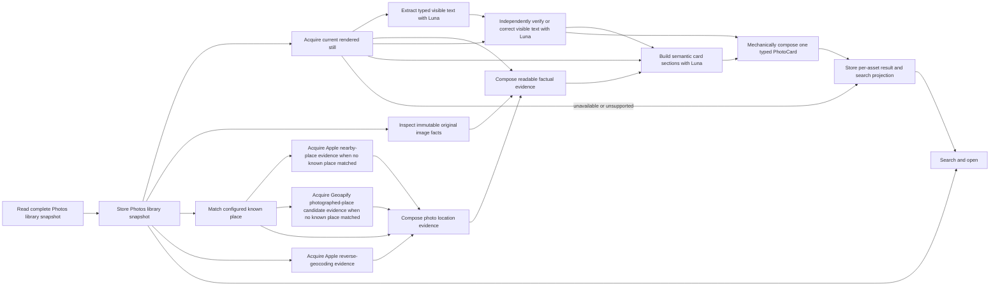

# Photos v1 architecture

This document defines the operating Photos product.

The Photos trawler gives OpenTrawl read-only access to Apple Photos. One update
indexes the library, acquires useful source facts and current images, enriches
capture location, generates searchable photo cards and stores the results.

The normal user invokes this work through `trawl update photos`. Import,
enrichment, classification and backfill are not separate product journeys.
`--maximum-assets N` keeps a development or approval run to at most N pending
photos while the source index still refreshes completely. A later update
resumes with the next pending photo.

## Dependency graph

Photos update is a small explicit dependency graph. Each substantial component
performs one job and can be run independently against real input. The update
composer is the only concurrency owner; components do not create worker pools
or a generic workflow engine.

The production-node registry names these components and their direct
dependencies. `trawl photos debug` renders that graph and dispatches the same
component operations used by the update composer. PhotoCard inspection uses
only model output retained for its exact current dependency identity. When
that output is absent, debug reports that external Luna work is required and
leaves the retained generation untouched; the normal update remains the path
that starts that work. The registry is inspection and product language, not a
generic workflow runtime.



Up to eight asset workers may occupy different nodes at once. Each worker owns
one lazily started Luna client for its lifetime; there is no shared generation
bottleneck or second worker pool. Within an asset, literal text extraction and
independent visual verification run in sequence as soon as current media is
available, beside location enrichment. Semantic card generation waits for both
verified OCR and composed location evidence. Missing GPS is a successful
terminal condition for location acquisition and does not prevent a card.
Unavailable or unsupported current media is an honest typed outcome and
prevents only visual card generation.

## Source and image roles

The trawler reads one complete Photos.sqlite library snapshot and stores
source-native assets, resources, album membership, capture facts and source
state. PhotoKit is used only for permission/readiness and exact current or
original media acquisition. It is not a competing library-enumeration path.
The trawler never changes Photos, albums, metadata, faces, media or iCloud.

The installed OpenTrawl app is the only PhotoKit client and the only macOS
permission identity. The CLI invokes its narrow typed local media boundary.
The app also owns permission-gated access to the media cache, including an
explicit external development root. There is no separate Photos helper app,
development permission identity or second approval journey.

Only a proved-complete snapshot may establish that an asset is missing. An
unavailable resource, failed extraction or incomplete source read is not a
source deletion.

Apple exposes two useful image roles:

- the immutable camera original supplies provenance and lossless ImageIO facts;
- the current rendered still, including user edits and orientation, supplies
  the image shown to the card model. The app applies the orientation into the
  pixels and supplies every model node with the same high-quality JPEG. Its
  longest edge is at most 1,200 pixels and smaller images are not enlarged.

The original and current image may be byte-identical, but the implementation
does not assume this. Image acquisition publishes an entry only after its
identity, size and digest are proved.

## Bounded media ownership

Media copies are regenerable working data, not a second Photos library. The
normal product uses one bounded resumable working cache. Initial implementation
limits are 512 MiB and a 2 GiB filesystem free-space floor; the source/media
outcome locks final values from measured peak active bytes and the largest real
entry. A proved entry is leased while a component reads it and removed after
its final durable consumer commits.
Abandoned partial files are removed during the next normal update.

Development points the same cache implementation at an explicitly configured
external volume so real-library proof cannot fill the internal SSD. It uses
the same admission, lease and release rules as the product. Peak active bytes,
large real assets and repeated-run cost decide whether a different bound or
development retention is actually needed; neither is a second resolver,
checkpoint database, source-selection rule or product workflow.

## Location evidence

Known capture places and configured geographic providers supply factual
context. Each provider operation retains its exact response and typed outcome
once in its provider-specific outcome. One provider never overwrites another.

Known-place matching runs before nearby-place acquisition. A known home or work
match preserves the Apple camera-location hierarchy and skips both providers'
place-candidate requests before transmission. It does not automatically become
the photographed place.

The current known-place configuration is part of derived location identity.
Changing it selects completed located photos again. Provider evidence is
reusable only when its complete typed request matches. Apple asks for at most
100 nearby results within 500 metres. Geoapify makes one Places request for at
most 20 results within 5 kilometres, so an unmatched photo consumes at most one
Geoapify free-plan credit. Its retained request includes the exact provider
categories chosen to surface landmarks, geographic areas, settlements and
transport features that the image may depict. The query asks for named places
and uses specific natural-feature categories rather than broad natural or river
parents that allow repeated map segments to consume the candidate page. A
known-place match skips that request before transmission.

Code retains provider order and removes only an exact repeated provider/place
identifier. The retained Apple outcome keeps the provider evidence, while the
PhotoCard briefing exposes only Apple's first ten results. This keeps the
provider's own relevance order and avoids filling Luna's input with a dense
urban directory. Geoapify supplies a complementary bounded set of potential
photographed places rather than a second reverse-geocoded hierarchy or another
broad business directory. Code does not semantically rank, merge, select a
venue or decide what the image depicts. The camera coordinate states where the
photographer stood; Luna judges whether the photographed place is across a
road, elsewhere in the candidate set or absent from provider data.

## Photo card boundary

The card boundary has exactly three fixed model judgement nodes. The first sends
the current rendered image to GPT-5.6 Luna and extracts the existing typed OCR
section. It keeps physically separate text regions distinct, preserves literal
exhaustive reading order, records honest uncertainty for unreadable markings,
and represents visible document structure with key-value fields and tables.
Extraction runs once per current-image and prompt identity and is retained.

The second receives only the same current image and retained extracted OCR. Its
one job is to check every retained region against the pixels and return either
an explicit verified state or a typed correction patch. Code validates and
applies the patch mechanically, then retains the verified OCR outcome before
semantic judgement.

The third receives the current image, verified OCR and a short human-readable
briefing made from useful capture, camera, lens, exposure, dimension,
known-place and geographic evidence. It decides what the image is of, where it
depicts and every other semantic card section. It does not receive raw ImageIO
properties, an internal database record, ProtoJSON dump, hashes, schema
versions, custody data or deterministic place conclusions.

The single card Protobuf defines all three model-node schemas and the mechanically
composed stored PhotoCard.
The card contains typed sections for concise and deliberately comprehensive
descriptions, the primary depicted subject, visible people, objects and
actions, ordered OCR regions and lines with legibility, an identified,
possible or unknown photographed-place judgement, searchable facts and
material uncertainties. Together, the three model responses must complete the
whole card contract; strings do not stand in for mechanical state or certainty.
The detailed description preserves all useful visible meaning but has no
minimum word count: a simple image does not earn padding, while a complex image
must not be shortened to meet a target.

Code validates all three typed responses. It validates and applies the second
node's OCR correction before the third node can receive the text. It then
mechanically combines verified OCR and semantic sections into the one stored
PhotoCard. A correction can replace or remove an exact retained
line or insert one or more complete missing lines or regions at a reading-order
position. Code verifies expected old text and structure; it never decides what
characters are correct and does not make photographic or place judgements. The
model judges visible text, visual meaning, place relevance, description and
uncertainty. Capture location remains a separate mechanical source fact. A
descriptions-only repair remains
an exceptional continuation of semantic card generation when, and only when,
all non-description sections already satisfy the contract.

OpenTrawl calls GPT-5.6 Luna through the local Codex app-server. Codex owns the
normal ChatGPT sign-in; OpenTrawl does not read or store OAuth tokens. The
classification turns are read-only, have no environment access or model
fallback, and use Protobuf-generated output schemas. Already authenticated
workers start independently. Only a required ChatGPT sign-in is serialised so
several workers cannot open competing approval journeys.

## Durable state and restart

Source facts, provider evidence and replaceable model interpretation remain
separate. Readiness is derived from completed typed dependency outcomes; there
is no stringly classification queue.

An external side effect has one durable progression:

```text
no output → request retained → transmission started → response retained → typed outcome stored
```

A retained response is not sent again merely because parsing or storage was
interrupted. Each actual provider or Luna transmission also has one append-only
attempt record containing its request identity, typed operation stage and
timing. Luna attempts also retain the app-server's final per-turn token usage;
attempt timestamps provide wall duration. The three model nodes can therefore be
costed before full backfill. This makes ambiguous, failed and completed
external work auditable
without copying the retained response. Provider attempt state and its canonical
typed outcome are stored in one transaction. Provider APIs do not supply an
exact-once key: an interrupted transmission is therefore recorded truthfully
as ambiguous and is retryable.
A provider may store a typed no-result. Only success, no-result and a nearby
request skipped for a known place satisfy a location dependency. Failure stays
pending and cannot compose a card. Media may store unavailable or unsupported.
Partial output never becomes complete.

Luna selects a supplied photographed-place candidate by its opaque identifier
and provides visual evidence for that judgement. It does not repeat the
provider-owned human name. Deterministic composition rejects unknown or
duplicate identifiers and inserts the canonical supplied name into the stored
PhotoCard.

Composed location evidence is stored once as the current source-fingerprint
and known-place-configuration-bound outcome. That row owns resume, card,
search and open consumption; there is no second composition history copy.

A changed input identity makes its derived result eligible for replacement. It
does not introduce prompt, parser, extractor, protocol or schema versions.
Before v1 there is one live schema and one supported path.

Database writes use short component transactions. The update command never
holds one library-wide transaction. Long work reports quiet component and
aggregate progress. Provider deferrals and failures remain resumable without
requiring manual repair, and one photo's retryable provider or model failure
does not cancel unrelated photos.

## Search and open

Search projects stored source facts and the current per-asset result. When a
card exists, open presents bounded human-readable facts, description, visible
people and content, OCR regions, key-value fields and tables, capture location
and photographed place without exposing private evidence
identifiers. Neither command performs new semantic inference.

Every indexed asset has one result. When current media is unavailable or
unsupported, search and open expose that honest typed reason instead of hiding
the asset or fabricating a card.

The integrated product is proved through the normal update, search and open
journey against a real library. Component inspection, tests and reviews may
support that judgement; they do not replace it.
