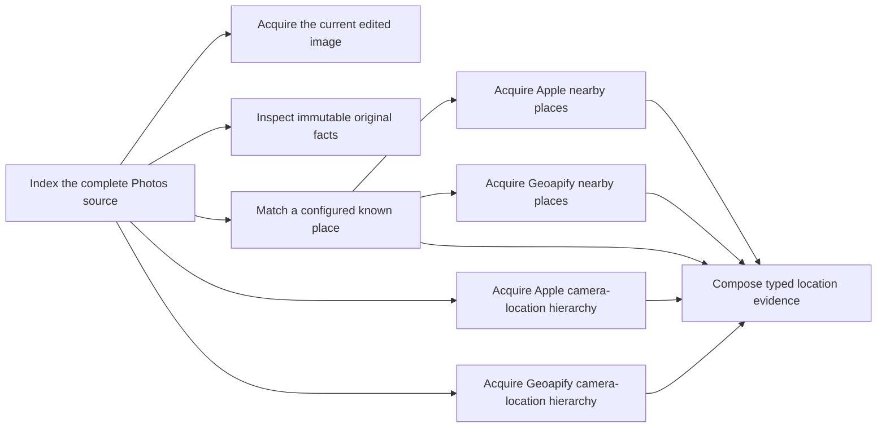

# Photos v1 architecture

OpenTrawl reads Apple Photos and stores durable facts that later image
classification can trust. The normal product has one idempotent command:
`trawl update photos`.

This document describes the Milestone 2 source, media and location foundation.
It does not define the PhotoCard, OCR or Luna interaction design. Those product
questions start again from real outputs after this foundation is accepted.

Direct Josh steering is product authority. Observed real behaviour is evidence.
Implementation choices are model hypotheses until Josh accepts them.

## Dependency graph

The Photos foundation is a small explicit DAG. Every node has one job, a typed
boundary and a retained outcome. The normal update composer calls these same
operations.



`trawl photos debug` lists this registry in dependency order and reads retained
typed state. It never changes the archive or calls a provider.

`trawl photos run NODE [PHOTO]` explicitly runs one production operation. A
missing dependency fails with its exact plain reason. The source node has no
photo argument because it indexes the library. All other nodes use a normal
`photos:…` link.

This is inspection plumbing, not a second product or workflow engine.

## Source

One complete read-only Photos library snapshot supplies assets, resources,
albums, capture facts and source state. PhotoKit does not enumerate a competing
source library.

Each source batch writes snapshot-scoped staging rows in a short transaction.
It does not change live assets or their dependent evidence. Only a complete
source receipt starts one publication transaction that applies changed source
rows, restores present assets, marks missing assets and advances the cursor.
A failed, cancelled or partial read discards its staging rows and leaves the
previous live source state intact.

`photos run source` executes only this operation. It does not acquire media or
call Apple or Geoapify location services.

## Current and original media

The current image and immutable original have different jobs:

- The current rendered still contains the user's edits and has its orientation
  applied to the pixels. Future visual judgement uses this image.
- The immutable original supplies original dimensions, type, byte count, digest
  and source facts. It is not silently substituted for the edited image.

Current-media reuse is bound to the Photos asset identifier and modification
time. Before original bytes are read, exactly one PhotoKit image original must
match the indexed source resource role, filename and type identifier. A known
indexed byte count is enforced while PhotoKit streams the resource. Missing,
ambiguous or changed identity returns one typed source-changed failure. A
changed original resource therefore invalidates its facts without invalidating
unrelated location evidence.

The installed OpenTrawl app is the only PhotoKit client and macOS permission
identity. The direct `trawl` helper sends a typed local request to the installed
app. Users run the helper as a normal CLI. The `OpenTrawlApp` SwiftUI executable
is a GUI and must be launched as an application; executing it as a CLI causes
an AppKit registration abort.

Media bytes are short-lived working data. A checked lease has a typed identity,
byte count, dimensions, orientation and SHA-256. The consumer verifies the bytes
before storing evidence and releases the lease after durable work completes.

For human inspection only, `photos run current-media PHOTO` atomically replaces
one 0600 JPEG in the normal external archive cache and prints its path. Read-only
debug never writes this file. This is one bounded inspection image, not a
gallery, second cache or photo library.

The current 512 MiB admission limit and 2 GiB free-space floor are model
hypotheses. Real largest-media and active-lease measurements decide whether
they remain. Development media stays on the external SSD.

## Location evidence

Capture location and photographed place are different concepts. Code retains
facts about the camera position and nearby provider results. A later image model
judges what the photograph depicts.

The operations are deliberately separate:

- Known-place matching compares the capture coordinate and capture time with
  configured homes, former homes and work locations.
- Apple reverse geocoding supplies the human geographic hierarchy around the
  camera.
- Geoapify reverse geocoding supplies a complementary OpenStreetMap geographic
  hierarchy around the camera.
- Apple nearby supplies Apple MapKit place candidates.
- Geoapify Places supplies complementary named OpenStreetMap place candidates.
- Composition checks that all dependency inputs match and stores one typed
  location-evidence outcome.

A known-place match keeps both camera-location hierarchies but skips Apple
nearby and Geoapify Places before transmission. The known place does not
automatically become the photographed subject.

Geoapify reverse geocoding uses the synchronous `/v1/geocode/reverse`
operation. Its typed provider request fixes the coordinate, GeoJSON response
format and one-result bound. The complete provider response, observation time,
attribution and parsed `AddressHierarchy` remain linked. Photos with the same
exact provider request reuse that retained evidence.

Apple request identity describes the evidence needed: an exact coordinate for
reverse geocoding, plus radius and result limit for nearby places. The mechanism
used to acquire the evidence is outcome provenance, not request identity. New
calls record MapKit. Reused older reverse evidence must record Core Location.
Evidence without known acquisition provenance is not admitted.

Existing Apple evidence is not accepted by its row count. M2 must compare
representative retained responses with their typed outcomes and the real
capture coordinates. The comparison must establish accuracy, useful geographic
detail, attribution and acquisition method before any row is reused.

Older Core Location evidence must remain labelled as Core Location. It must
not be silently relabelled as MapKit. A retained result may be reused only when
its exact typed request and evidence still satisfy the accepted operation.
Different nearby radii, result bounds or acquisition methods are different
evidence.

Provider evidence is keyed by the deterministic typed provider request, not by
one asset. Photos with the same exact request reuse one exact retained response.
Each asset keeps a typed link to the provider outcome it consumed. Composition
preserves provider order and does not turn proximity into a photographed-place
decision.

Every external operation retains:

- the exact typed request;
- transmission state;
- the exact response;
- observed time and provider attribution;
- a parsed typed outcome;
- a typed failure and retry time when the provider fails.

The current Apple radius and candidate limit are 500 metres and 100 candidates.
The current Geoapify experiment uses a 5 km radius, a 20-result limit and eight
provider-native category roots. These are model hypotheses, not Josh decisions.
The 5 km range retained distant towns, parks and landmarks that the 500 m Apple
operation cannot supply. The shorter category request replaced an unapproved
45-entry list. A saturated provider result is bounded evidence, not a complete
list and not a photographed-place conclusion.

Apple reverse and nearby operations share MapKit's location-service throttle.
The composer starts no more than one Apple MapKit request every 1.5 seconds.
This interval is a model engineering hypothesis based on an observed provider
throttle, not a Josh decision or a documented Apple quota. A bounded real run
must prove that it is quiet and useful before any Apple acquisition at scale.

The provider operations retain every returned candidate. Composition does not
select candidate names or categories. It records each operation's state,
provenance and returned candidate count. This keeps hard-coded subject judgement
out of plumbing and prevents a directory of nearby businesses from becoming the
model briefing. The complete typed provider result stays available to the later
image-model operation.

One synchronous Geoapify request costs one credit. A photo without reusable
evidence may use one reverse-geocoding request and one Places request. Geoapify
also supports asynchronous batches of up to 1,000 wrapped operations. A low
priority batch currently charges half the wrapped-operation credits plus job
creation and result retrieval. This is not 100 photos for one credit.

No Geoapify corpus backfill is part of M2. Backfill capacity is measured from
the accepted request design before approval. Reverse geocoding needs an exact
enough coordinate to preserve address truth. Nearby-place acquisition can use a
shared spatial request only if real corpus comparisons show that the shared
result remains useful and the query coordinate stays explicit.

Geoapify's free plan currently provides 3,000 credits per day. Request starts
are at least 200 milliseconds apart across all workers. The current rolling
24-hour credit counter is a model engineering decision, not a Josh decision.
When it is exhausted, Geoapify work defers without preventing independent local
or Apple nodes from completing. Exact daily-reset and batch accounting must be
proved before a provider backfill.

## Concurrency and restart

The update composer owns concurrency. Components do not create worker pools or
competing schedulers.

Across assets, the composer permits a small fixed number of active workers.
Within one asset, current media, immutable original facts and location work are
independent. After known-place matching, Apple reverse, Geoapify reverse and
the permitted nearby operations may overlap. Composition waits for their
retained typed outcomes.

An external operation progresses through durable states:

```text
request retained → transmission started → response retained → typed outcome stored
```

A retained response is parsed again rather than transmitted again. An
interrupted or failed operation remains truthful and resumable. Database writes
use short component transactions; there is no library-wide transaction.

## Observability

Each explicit node execution records the node name, acquired/reused/skipped/
deferred/failed outcome and elapsed time in the normal Photos log. Source and
photo-processing phases also record their elapsed time. Provider
transmission attempts and retry state are durable. Aggregate update progress
reports active work, media leases and completed outcomes without requiring user
maintenance.

Logs are supporting evidence. Acceptance still comes from the direct CLI on
real photos: inspect the exact input, run or reuse one operation, read the full
human output and see the retained result become the next node's dependency.

## M2 acceptance boundary

M2 is accepted only when the exact signed installed product proves:

- complete source indexing and an unchanged replay;
- current edited, rotated, local and iCloud-backed images;
- distinct immutable original facts;
- known-place matching and zero-call nearby suppression;
- useful, attributable Apple and Geoapify provider outcomes;
- a compact location briefing that does not bury useful evidence in provider
  directory spam;
- normal update composition, retry, resume, reuse and quiet external-disk use;
- no new crash class.

One fresh zero-context reviewer judges this major milestone against Josh's
newest steering and the real installed CLI. At most one bounded correction
follows. Then work stops for Josh. No corpus backfill, OCR, Luna or PhotoCard
work starts in M2.
